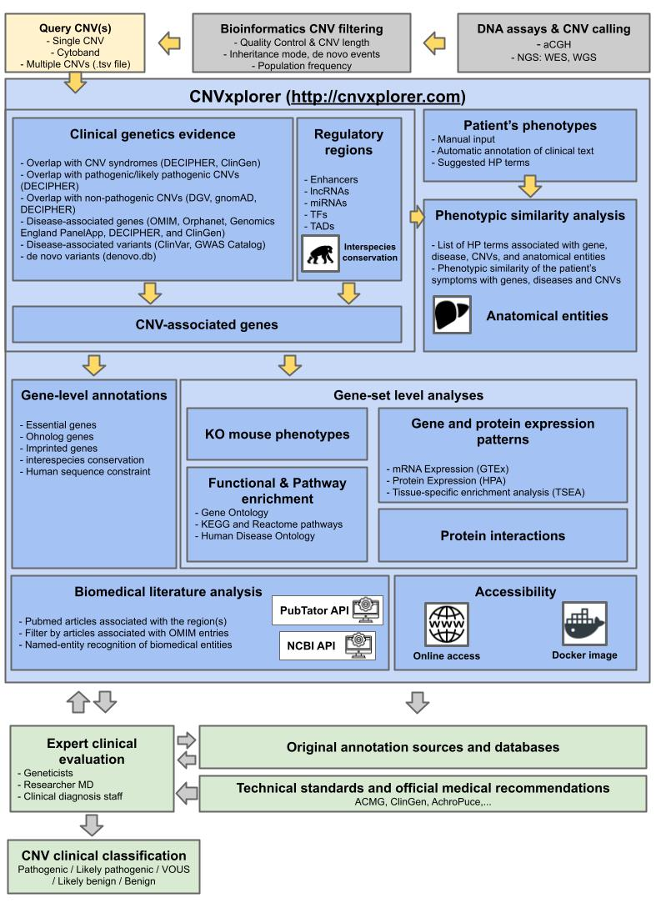
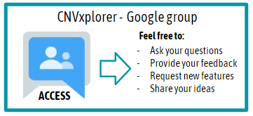

## Overview

CNVxplorer is a user-friendly web application developed to assist in the clinical interpretation of CNVs. For this purpose, CNVxplorer provides the user with the following main features:

  

## Features 

* Query a genomic interval, cytoband, or upload a file with multiple genomic regions and analyze it simultaneously.
* Compare the genetic evidence of disease genes from five different databases (OMIM, ORPHANET, ClinGen, DECIPHER, and Genomics England PanelApp).
* Explore CNV syndromes, pathogenic and non-pathogenic CNVs, disease variants (ClinVar, GWAS), and denovo variants (denovo.db) that overlap with the CNVs.
* Find regulatory elements disrupted by the variant and their target genes.
* Consider those target genes that do not map the input variant(s) in the subsequent analysis (optional).
* Identify relevant diseases and genes based on phenotypic similarity with the clinical characteristics of the patient.
* Check the phenotype of the orthologous genes in experiments with mouse models.
* Find PubMed articles related to your variants and filter the relevant ones by keyword, number of citations, or by association with the OMIM database.

## How to cite

Requena, Francisco, et al. [“CNVxplorer: a web tool to assist clinical interpretation of CNVs in rare disease patients.” Nucleic acids research: gkab347](https://academic.oup.com/nar/article/49/W1/W93/6279834)

## Google group

## News

- **v. 0.4 (20/07/2021)**. Integration with CNVscore + fixed minor bugs
- **v. 0.32 (20/07/2021)**. Updated reference.
- **v. 0.31 (19/04/2021)**. Added one order of magnitude to p-values calculation (lower than 0.0001)
- **v. 0.3 (12/04/2021)**. Added FAQs questions regarding phenotypic similarity p-values.
- **v. 0.21 (11/04/2021)**. Added new version of CNV syndromes ClinGen
- **v. 0.2 (10/04/2021)**. Added p-values phenotypic similarity; added segmental duplications to the list of prob. regions
- **v. 0.14 (07/04/2021)**. Fixed minor errors, added scroller; added  ClinVar variants in CNV's length distribution
- **v. 0.13 (17/03/2021)**. Added Imagine logo, overview figure and terms of use
- **v. 0.12 (06/03/2021)**. Added genetic and phenotypic entities information (bar and co-occurrence plot) + search entities in Title+Abstract; Change of titles; New Documentation tab with the version of databases used
- **v. 0.11 (17/12/2020)**. Added help buttons; Fixed minor bugs; changed structure FAQs 
- **v. 0.1 (8/12/2020)**. Public release.
