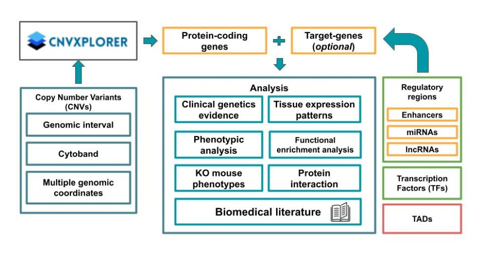

## Overview

CNVxplorer is a user-friendly web application developed to assist in the clinical interpretation of CNVs. For this purpose, CNVxplorer provides the user with the following main features:

  

## Features 

* Query a genomic interval, cytoband, or upload a file with multiple genomic regions and analyze it simultaneously.
* Compare the genetic evidence of disease genes from five different databases (OMIM, ORPHANET, ClinGen, DECIPHER, and Genomics England PanelApp).
* Explore CNV syndromes, pathogenic and non-pathogenic CNVs, disease variants (ClinVar, GWAS), and denovo variants (denovo.db) that overlap with the CNVs.
* Find regulatory elements disrupted by the variant and their target genes.
* Consider those target genes that do not map the input variant(s) in the subsequent analysis (optional).
* Identify relevant diseases and genes based on phenotypic similarity with the clinical characteristics of the patient.
* Check the phenotype of the orthologous genes in experiments with mouse models.
* Find PubMed articles related to your variants and filter the relevant ones by keyword, number of citations, or by association with the OMIM database.

## FAQs

**What is the query used to retrieve the articles related to my variant(s)?**

First, the program converts genomic intervals into cytobands. To do this, we identify the cytobands that are mapped with the variants. Once we get this list of cytobands, the program makes the following query:

*((chromosome number + cytoband) OR chrom-cytoband) AND (deletion OR microdeletion) AND Homo sapiens
((chromosome number + cytoband) OR chrom-cytoband) AND duplication AND Homo sapiens*

For instance:

*((chromosome 1+ p36.33) OR 1p36.33) AND (deletion OR microdeletion) AND Homo sapiens
((chromosome 1+ p36.33) OR 1p36.33) AND duplication AND Homo sapiens*

**How is the percentage of overlapping calculated?**

On the one hand, if the measured overlapping is between the query region and a CNV from a reference database, such as gnomAD v.2.1, the reference region is the user's query. On the other hand, if the measured overlapping is between the query region and a gene, then the reference region is the gene.

**How is the similarity score calculated?**

To calculate the similarity between two sets of phenotype terms, we use Resnik's symmetrical similarity. Next, the scores are aggregated with Best Match Average (BMA).

**I have found an error. What should I do?**

Please contact us with the information needed to replicate the problem. If your query is a genomic interval, please send us a description of the error along with the genomic interval (chromosome:start-end). In the case of a cytoband, we only need the chromosome and the name of the band. Finally, if your query is a file, there are two options: send us the genomic interval that you think is causing the problem or the file ONLY with the following columns: chromosome, start, and end.

**I have an idea to improve the application. How can I contact you?**
We would be very happy to hear your suggestions. In the tab “Contact” of the application, you can find our email address. 

**Can I run CNVxplorer locally?**

Yes, there are two options: download the application and install the Docker image using the Dockerfile (recommended) or install manually all package dependencies in your R session. You can find more information about the installation on the [repository site](https://github.com/frequena/cnvxplorer).

**Does CNVxplorer filter out variants based on quality metrics?**

No, CNVxplorer does not make any assumptions about the quality of each variant. Before uploading the file, the user must identify and remove poor quality variants.

**What input format does CNVxplorer accept?**

Currently, we accept a .tsv file with a header and four columns. It is important that the columns are arranged as identifier - chromosome - start - end.

**Can I deploy CNVxplorer on my own server?**

Sure! We recommend deploying the application with Docker ( [instructions](https://github.com/frequena/cnvxplorer) ). The default port where the Docker container will listen is 3838. In case you want to deploy to a different port, you just need to change it in the Dockerfile (instruction: EXPOSE). Please note that CNVxplorer requires an Internet connection.

**Is there a limit on the number of variants that can be uploaded into CNVxplorer?**

Currently, we have limited the number of variants to 200.

**Can I download a .png image from the plots?**

Yes, you can download it by right-clicking on the image and “Save image as…”.

**There are two or more variants that overlap with a CNV. What percentage of overlapping is shown?**

If two or more variants overlap with a CNV, the percentage of overlapping displayed corresponds to the variant with the highest overlapping.

**Why did I get a maximum of 600 PubMed articles?**

Currently, CNVxplorer retrieves a maximum of 600 PubMed articles per query. This threshold is more than sufficient for most cases. But if you consider this number is not enough, you can make your own query on the PubMed website or reduce the number of variants if your query is a file.

**Why all the scores have a scale between 1 and 100?**

Since each score has a different scale, to facilitate the interpretation and comparison, we convert the raw score into a percentile rank. For instance, a gene whose pLI score is 95 means that 95% of the other raw scores were below that gene. Besides, we established that a higher percentile is indicative of higher pathogenicity in all the scores.

