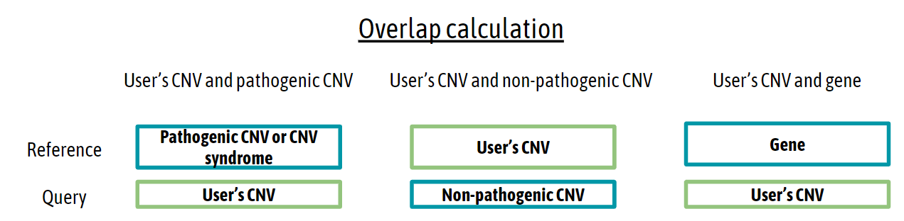
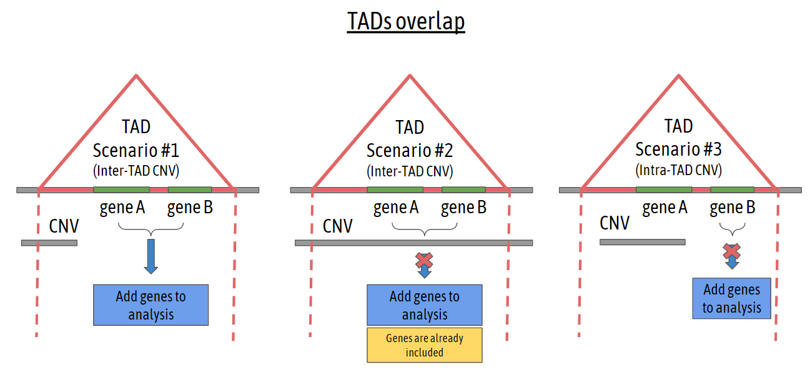

## FAQs

### Input data

- **What is the maximum length allowed for a CNV ?**

We set a limit of 15Mb. If you enter a BED file with a longer CNV, this variant is discarded automatically.

- **Does CNVxplorer filter out variants based on quality metrics?**

No, CNVxplorer does not make any assumptions about the quality of each variant. Before uploading the file, the user must identify and remove poor quality variants.

- **What input format does CNVxplorer accept?**

Currently, we accept files with .bed format with a header and four columns.The columns need to be arranged and named as following: chrom - start - end - type. We provide an example file. To download it, you will find the link in the Overview tab - Multiple coordinates option - Download file example [#1].

- **Is there a limit on the number of variants that can be uploaded into CNVxplorer?**

Currently, we have limited the number of variants to 200.

### General information

- **How to cite CNVxplorer?**

The CNVxplorer manuscript is available on:

Requena, Francisco, et al. [“CNVxplorer: a web tool to assist clinical interpretation of CNVs in rare disease patients.” Nucleic acids research: gkab347](https://academic.oup.com/nar/article/49/W1/W93/6279834)

- **How problematic regions of the human genome and segmental duplications were defined and where can I get their breakpoint coordinates?**

Problematic regions of the human genome were obtained from the ENCODE blacklist ((26), version 2). ENCODE blacklist reports a comprehensive set of regions in the human genomes that have anomalous, unstructured or high signal in next-generation sequencing runs, independent of cell line or experiment. Amemiya et al. classified  problematic regions into two major types: (i) high-signal regions, identified as being overrepresented in sequencing reads and ChiP-seq peaks, which presumably represent unannotated repeats or artifacts in the human genome assembly GRCh37; and (ii) low-mappability regions, which represent short repetitive elements in the genome assembly that are poorly mappable. A total of 583 high-signal regions and 251 low-mappability regions for the GRCh37 genome assembly were obtained from https://github.com/Boyle-Lab/Blacklist/ (version 2; file hg19-blacklist.v2.bed.gz). In addition to the previous problematic regions, we considered human Segmental Duplications (SD), also known as low copy repeats (LCRs). SDs were defined in (PMID: 16770338 ) as continuous portions of DNA that map to two or more genomic locations, can contain any standard constituent of genomic DNA, including genic sequence and common repeats, and can either be organized in tandem or map to interspersed locations. SDs detected in the human genome GRCh37 were obtained from the Segmental Duplication Database, which focuses on genomic duplications >1000bp and >90% identity. (file GRCh37GenomicSuperDup.tab from https://humanparalogy.gs.washington.edu/build37/build37.htm).   

- **How do we delimit gene coordinates?**

To delimit a gene, CNVxplorer uses the attributes, start_position, and end_position, provided by Ensembl. These two attributes refer to the outermost transcript start and end coordinates, respectively.

- **How is the percentage of overlap calculated?**

To calculate the overlap of any two genomic regions, we need to specify the reference and the query. CNVxplorer sets your CNV(s) submitted as reference or query depending on the following scenarios:

  

For instance, a 100% overlap represents that the query encompasses the entire reference.

- **There are two or more variants that overlap with a CNV. What percentage of overlapping is shown?**

If two or more variants overlap with a CNV, the percentage of overlapping displayed corresponds to the variant with the highest overlap.

- **Can I download a .png image from the plots?**

Yes, you can download it by right-clicking on the image and “Save image as…”.

- **In the comparison CNV plot (Overview), what is the difference between the option global and local?**

CNVxplorer displays the length of your CNV(s) and compares it with the length distribution of CNVs from public databases (e.g. gnomAD). If the user selects the option local, only CNVs that are mapping with the query interval will be displayed.

### Disease-related information

- **Why do all the pathogenicity-predicted scores have a scale between 1 and 100?** 

Since each score uses a different scale, we convert each raw score into a percentile rank to facilitate the interpretation and comparison. For instance, if a gene has a value of 95 in the pLI column, it means that 95% of the rest of genes of the human genome have an equal or lower pLI score. Apart from that, all the percentile scores follow the same approach: as higher the percentile, higher is the pathogenicity.

- **How is the list of OMIM disease genes defined?**

The database OMIM comprises a comprehensive list of Mendelian disease genes. There are some gene-disease associations where 1) the supporting evidence is low, 2) the gene disruption leads to cancer, 3) the mutation only represents risk or susceptibility, and 4) the mutation described is somatic. To select only monogenic Mendelian diseases, we filter out all these entries.

- **Pathogenicity prediction scores**

CNVxplorer builds upon and complement existing tools by integrating genic intolerance scores based on the analysis of sequencing data in the human population:

- **pLI**. The gene probability of loss-of-function intolerance. Estimation of the deviation of rare and de novo protein-truncating variants from a neutral model of de novo variation through analysis of 125,748 exome sequences and 15,708 whole-genome sequences from gnomAD v.2.1.1.

- **RVIS**. This score evaluates and ranks genes by comparing the overall number of observed variants in a gene to the observed common functional variants. The RVIS score is based on ExAC v2.
- **HI Index**. Haploinsufficiency score based on predictions using a classification model that evaluates inter-species conservation, gene expression, and network proximity information of the gene to predict the probability of being haploinsufficiency. High ranks (e.g. 0-10%) indicate a gene is more likely to exhibit haploinsufficiency, low ranks (e.g. 90-100%) indicate a gene is more likely to not exhibit haploinsufficiency. 
- **CCR**. The number of constrained coding regions (CCRs) from observed variants among 123,136 humans from the Genome Aggregation Database (gnomAD). 
- **SnIPRE**. A score which allows identifying genes under natural selection based on the comparison of polymorphism and divergence at synonymous and non-synonymous sites.
- **Gene Damage Index (GDI)**. A gene-level metric of the mutational damage that has accumulated in the general population.

In addition, the application integrates scores evaluating the intolerance to variants based exclusively on the regulatory regions of the gene:

- **ncRVIS**. Analogous score to RVIS, but assessing variants in regulatory sequences (5’UTR, 3’UTR, and promoter) of the gene. This score is based on 690 whole-genome sequenced samples generated at the Duke Center for Human Genome Variation (CHGV).
- **ncGERP**. Phylogenetic conservation based on non-coding regions based on the GERP++ software. Given a multiple sequence alignment, GERP++ identifies sites under evolutionary constraint.

### Phenotypic analysis

- **How is the similarity score p-value calculated?**

First, we generate a background distribution for each entity (disease, gene, or DECIPHER CNV). To do this, we calculate Resnik's similarity between the HP terms associated with the entity and 1,000 random sets of HP terms. We repeat this process ten times, varying the length (from 1 to 10) of the random set. As a consequence, for each entity, we generate a total of 10,000 Resnik's similarity scores representing its background distribution. 

During the user's session, CNVxplorer calculates the Resnik's measure between the patient's clinical symptoms (entered by the user) and each entity associated with the query. Finally, it filters the background distribution corresponding to the entity (and the number of entered HP terms) and counts the number of random values lower than the calculated one.

- **Why CNVxplorer does only provide a p-value and not the raw clinical similarity score between the query CNV(s) and a reference instance (e.g. pathogenic CNV, gene or disease)?**

The phenotypic similarity calculation implemented in CNVxplorer follows the Phenomizer approach (Köhler et al, AJHG 2009). As indicated in the original publication, the raw similarity score between two sets of HPO terms depends on the number and the specificity of the HPO terms that constitute both lists. Thus, quoting the authors: “It is thus not possible to say what score constitutes a ‘good match’ for a general query”. However, a Monte Carlo random sampling approach referred as Ontological Similarity Search with p values (OSS-PV), was proposed in order to provide a p-value associated with the raw clinical similarity scores. Here p-values can be interpreted as the probability of observing the same or a higher score between a random query list (i.e., constituted of N randomly selected HPO terms) and a reference instance (e.g. pathogenic CNV, gene or disease). In contrast to the raw clinical similarity scores, OSS-PV based p-values allow to rank instances by clinical similarity and are thus the values displayed in the application.

- **Why some clinical similarity p-values show a slash '-' symbol rather than a value?**

For computational reasons, CNVxplorer only stores in memory the top 5% of the background distribution values generated in the OSS-PV approach (see above), which allows us to estimate significant p-values < 0.05. Thus, when clinical similarity scores p-values were equal to or above above the 0.05 threshold, they are consider not statistically significant and are displayed with a slash '-' symbol.

Note the slash symbol can be displayed when no HP term has been entered by the user or there is not available phenotypic information about the gene, disease or DECIPHER CNV.

- **I have found a non-disease gene with HPO.**

Probably, that gene is in OMIM but was filtered out because it did not meet any of the requirements (please see the question: How is the list of OMIM disease genes defined?).

### Regulatory elements

- **Why do I find less enhancers in CNVxplorer than GeneCards in a specific region?**

We only display enhancers and target-enhancer associations with a quality score above 1.

- **Do all miRNAs and lncRNAs in the region are displayed?**

No, we only consider miRNAs and lncRNAs with, at least, one target-gene association.

- **How does TAD overlapping work?**

We contemplate three scenarios depending on the sort of mapping between TAD and CNV. To illustrate this, we represent these scenarios in the following image:

  

### Biomedical literature

- **What is the query used to retrieve the articles related to my variant(s)?**

First, the program converts genomic intervals into cytobands. To do this, we identify the cytobands that are mapped with the variants. Once we get this list of cytobands, the program makes the following query:

  <i>((chromosome number + cytoband) OR chromosome_cytoband) AND (deletion OR microdeletion) AND Homo sapiens
  ((chromosome number + cytoband) OR chromosome_cytoband) AND duplication AND Homo sapiens</i>

For instance:

<b> Genomic interval (chr1:1-100000) -> cytoband: p36.33 </b>

<i>((chromosome 1+ p36.33) OR 1p36.33) AND (deletion OR microdeletion) AND Homo sapiens</i>

<i>((chromosome 1+ p36.33) OR 1p36.33) AND (duplication OR microduplication) AND Homo sapiens</i>

- **Why did I get a maximum of 600 PubMed articles?**

Currently, CNVxplorer retrieves a maximum of 600 PubMed articles per query. This threshold is more than sufficient for most cases. But if you consider this number is not enough, you can make your own query on the PubMed website or reduce the number of variants if your query is a BED file.

### CNVxplorer installation

- **Can I run CNVxplorer locally?**

Yes, there are two options: download the application and install the Docker image using the Dockerfile (recommended) or install manually all package dependencies in your R session. You can find more information about the installation on the repository site (https://github.com/frequena/cnvxplorer) or the section "Installation" located in the tab Documentation.

- **Can I deploy CNVxplorer on my own server?**

Sure! We recommend deploying the application with Docker (https://github.com/frequena/cnvxplorer). The default listener port is 3838. In case you want to set a different port, you can do it just changing the instruction "EXPOSE" in the Dockerfile. Please note that CNVxplorer requires an Internet connection.

### Errors and suggestions

- **I have found an error. What should I do?**

Please contact us with the information needed to replicate the problem. If your query is a genomic interval, please send us a description of the error along with the genomic interval (chromosome:start-end). In the case of a cytoband, we only need the chromosome and the name of the band. Finally, if your query is a file, there are two options: send us the genomic interval that you think is causing the problem or the file ONLY with the following columns: chromosome, start, and end.

- **I have an idea to improve the application. How can I contact you?**

We would be very happy to hear your suggestions. In the tab “Contact” of the application, you can find our email address. 

