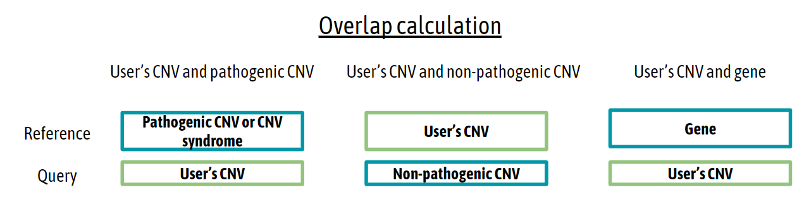

## FAQs

**How do we define gene coordinates?**

To define a gene, CNVxplorer uses the attributes, start_position, and end_position, provided by Ensembl. These two attributes refer to the outermost transcript start and end coordinates, respectively.

**What is the query used to retrieve the articles related to my variant(s)?**
First, the program converts genomic intervals into cytobands. To do this, we identify the cytobands that are mapped with the variants. Once we get this list of cytobands, the program makes the following query:

*((chromosome number + cytoband) OR chromosome_cytoband) AND (deletion OR microdeletion) AND Homo sapiens
((chromosome number + cytoband) OR chromosome_cytoband) AND duplication AND Homo sapiens*

For instance:

Genomic interval (chr1:1-100000)
cytoband: p36.33

*((chromosome 1+ p36.33) OR 1p36.33) AND (deletion OR microdeletion) AND Homo sapiens
((chromosome 1+ p36.33) OR 1p36.33) AND duplication AND Homo sapiens*

**How is the percentage of overlap calculated?**

To calculate the overlap of any two genomic regions, we need to specify the reference and the query. CNVxplores uses this approach: 

  

**Do all miRNAs and lncRNAs in the region are displayed?**
No, we only consider miRNAs and lncRNAs with, at least, one target gene.

**How is the similarity score calculated?**
To calculate the similarity between two sets of phenotype terms, we use Resnik's symmetrical similarity. Next, the scores are aggregated with Best Match Average (BMA). 

**What is the maximum length of a CNV allowed? (check grammar)
We set a limit of 15Mb. If you enter a longer CNV, this variant is discarded automatically.

**I have found an error. What should I do?**
Please contact us with the information needed to replicate the problem. If your query is a genomic interval, please send us a description of the error along with the genomic interval (chromosome:start-end). In the case of a cytoband, we only need the chromosome and the name of the band. Finally, if your query is a file, there are two options: send us the genomic interval that you think is causing the problem or the file ONLY with the following columns: chromosome, start, and end.

**I have an idea to improve the application. How can I contact you?**
We would be very happy to hear your suggestions. In the tab “Contact” of the application, you can find our email address. 

**Can I run CNVxplorer locally?**
Yes, there are two options: download the application and install the Docker image using the Dockerfile (recommended) or install manually all package dependencies in your R session. You can find more information about the installation on the repository site. (https://github.com/frequena/cnvxplorer).

**Does CNVxplorer filter out variants based on quality metrics?**

No, CNVxplorer does not make any assumptions about the quality of each variant. Before uploading the file, the user must identify and remove poor quality variants.

** What input format does CNVxplorer accept?**

Currently, we accept files with .bed format with a header and four columns.The columns need to be arranged as chromosome - start - end - type.

**Can I deploy CNVxplorer on my own server?**

Sure! We recommend deploying the application with Docker (https://github.com/frequena/cnvxplorer). The default port where the Docker container will listen is 3838. In case you want to deploy to a different port, you just need to change it in the Dockerfile (instruction: EXPOSE). Please note that CNVxplorer requires an Internet connection.

**Is there a limit on the number of variants that can be uploaded into CNVxplorer?**

Currently, we have limited the number of variants to 200.

**Can I download a .png image from the plots?**

Yes, you can download it by right-clicking on the image and “Save image as…”.

**There are two or more variants that overlap with a CNV. What percentage of overlapping is shown?**

If two or more variants overlap with a CNV, the percentage of overlapping displayed corresponds to the variant with the highest overlapping.

**Why did I get a maximum of 600 PubMed articles?**

Currently, CNVxplorer retrieves a maximum of 600 PubMed articles per query. This threshold is more than sufficient for most cases. But if you consider this number is not enough, you can make your own query on the PubMed website or reduce the number of variants if your query is a file.

**Why do all the pathogenicity-predicted scores have a scale between 1 and 100?** 

Since each score uses a different scale, we convert each raw score into a percentile rank to facilitate the interpretation and comparison. For instance, if a gene has a value of 95 in the pLI column, it means that 95 of the rest of genes have an equal or lower pLI score. Apart from that, all the percentile scores follow the same approach: as higher the percentile, higher is the pathogenicity.

**How is the list of OMIM disease genes defined?**

The database OMIM comprises a comprehensive list of Mendelian disease genes. There are some gene-disease associations where 1) the supporting evidence is low, 2) the gene disruption leads to cancer, 3) the mutation only represents risk or susceptibility, and 4) the mutation described is somatic. To select only monogenic Mendelian diseases, we filter out all these entries.

**I have found a non-disease gene with HPO**

Probably, that gene is in OMIM but was filtered out because it did not meet any of the requirements (please see the question: How is the list of OMIM disease genes defined?)

**In the comparison CNV plot (Overview), what is the difference between the option global and local?**

CNVxplorer displays the length of your CNV(s) and compares it with the length distribution of CNVs from public databases (e.g. gnomAD). If the user selects the option local, only CNVs that are mapping with the query interval will be displayed.

**Pathogenicity prediction scores**

CNVxplorer builds upon and complement existing tools by integrating genic intolerance scores based on the analysis of sequencing data in the human population:

- **pLI**. The gene probability of loss-of-function intolerance, estimating the deviation of rare and de novo protein-truncating variants from a neutral model of de novo variation through analysis of high-quality exome sequence data for 60,706 individuals of diverse ethnicities from the Exome Aggregation Consortium (ExAC). Genes with high pLI scores (pLI ≥ 0.9) are extremely Loss of Function (LoF) intolerant, whereby genes with low pLI scores (pLI ≤ 0.1) are LoF tolerant.
- **RVIS**. This score evaluates and ranks genes by comparing the overall number of observed variants in a gene to the observed common functional variants. The RVIS score is based on ExAC v2.
- **HI Index**. Haploinsufficiency score based on predictions using a classification model that evaluates inter-species conservation, gene expression, and network proximity information of the gene to predict the probability of being haploinsufficiency. High ranks (e.g. 0-10%) indicate a gene is more likely to exhibit haploinsufficiency, low ranks (e.g. 90-100%) indicate a gene is more likely to not exhibit haploinsufficiency. 
- **CCR**. The number of constrained coding regions (CCRs) from observed variants among 123,136 humans from the Genome Aggregation Database (gnomAD). 

In addition, the application integrates scores evaluating the intolerance to variants based exclusively on the regulatory regions of the gene:

- **ncRVIS**. Analogous score to RVIS, but assessing variants in regulatory sequences (5’UTR, 3’UTR, and promoter) of the gene. This score is based on 690 whole-genome sequenced samples generated at the Duke Center for Human Genome Variation (CHGV).
- **ncGERP**. Phylogenetic conservation based on non-coding regions based on the GERP++ software. Given a multiple sequence alignment, GERP++ identifies sites under evolutionary constraint.