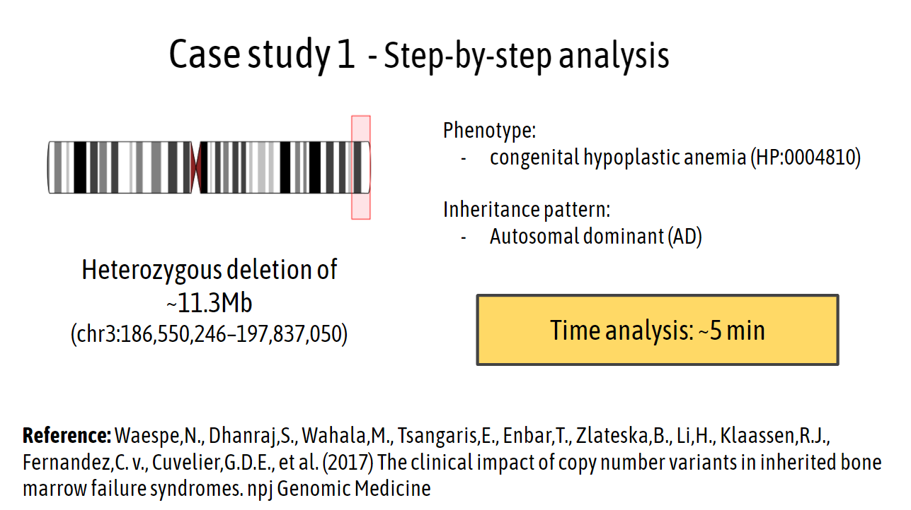
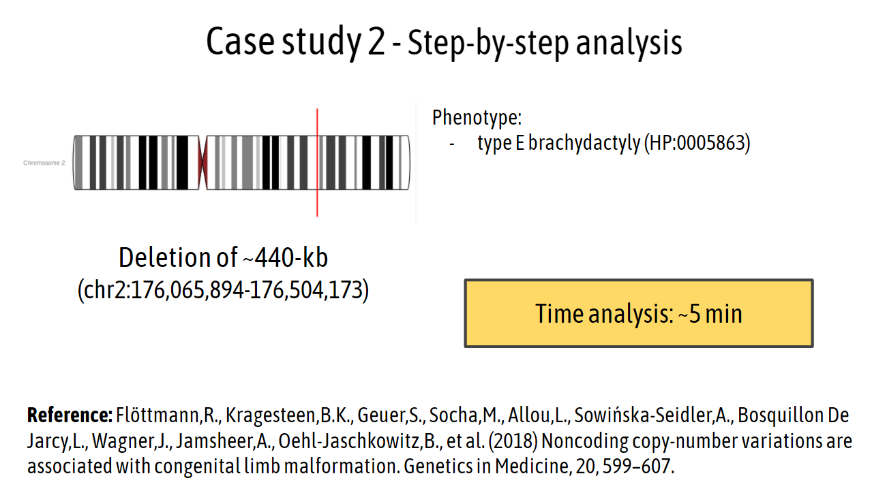

## Case study 1 <a href="https://docs.google.com/presentation/d/e/2PACX-1vSpRAD9nGs2Yz3nMxBZdLjiQsmTpGrysmZj0IhQEGDTNbIuIHXjxM5rKLb2sc9abLRpcDRVXcMuoTW-/pub?start=true&loop=true&delayms=5000" target="_blank">(Link)</a>

  

## **You can find the slides at** <a href="https://docs.google.com/presentation/d/e/2PACX-1vSpRAD9nGs2Yz3nMxBZdLjiQsmTpGrysmZj0IhQEGDTNbIuIHXjxM5rKLb2sc9abLRpcDRVXcMuoTW-/pub?start=true&loop=true&delayms=5000" target="_blank">(Link)</a>

## Case study 2 <a href="https://docs.google.com/presentation/d/e/2PACX-1vQFFE8NpQ3LUj_TDErh61dUQ4zhGX4cmj_Qkj3D9wpCszkxTmN3PcLJGE2ITXjwxrDLVQe_Nw2C2B3i/pub?start=true&loop=true&delayms=5000" target="_blank">(Link)</a>

  

## **You can find the slides at** <a href="https://docs.google.com/presentation/d/e/2PACX-1vQFFE8NpQ3LUj_TDErh61dUQ4zhGX4cmj_Qkj3D9wpCszkxTmN3PcLJGE2ITXjwxrDLVQe_Nw2C2B3i/pub?start=true&loop=true&delayms=5000" target="_blank">(Link)</a>

